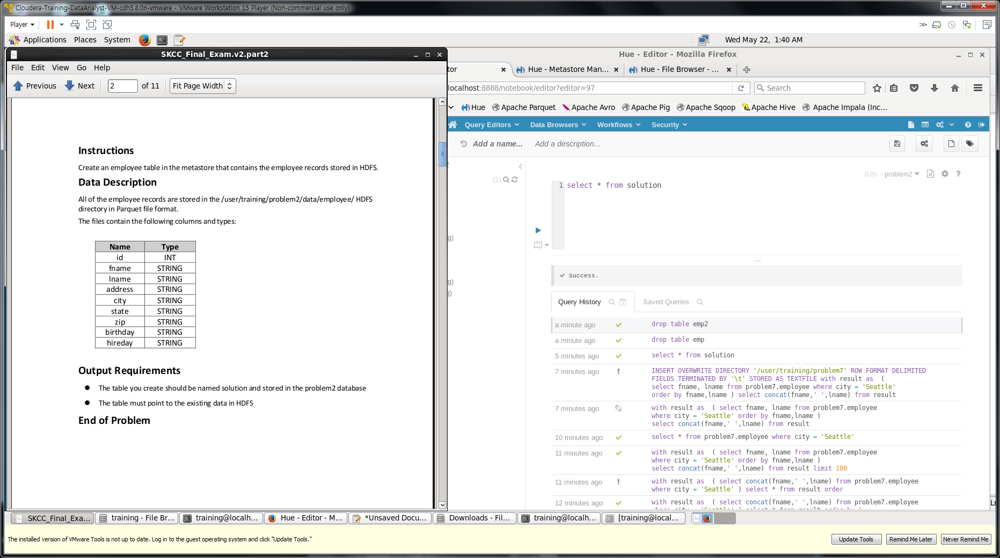
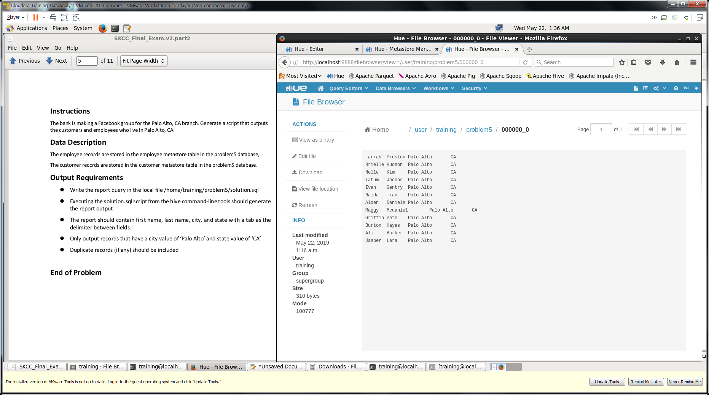
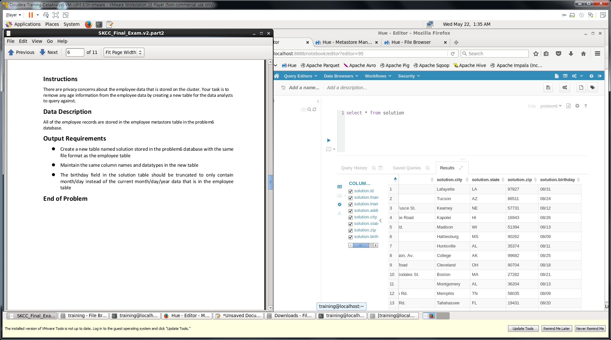
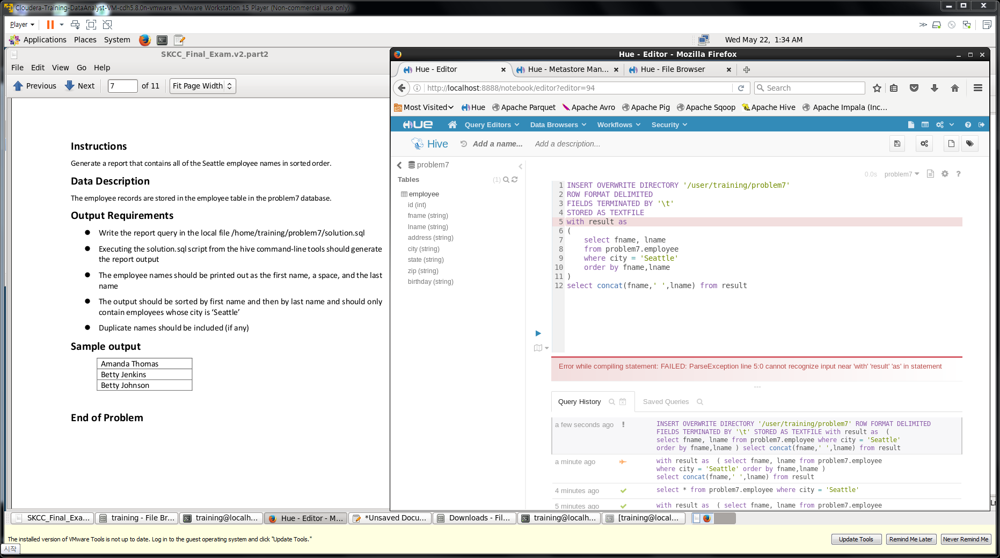

### part2_2

```sql
create database problem2;

create external table problem2.employee (
   id           INT
 , fname        STRING
 , lname        STRING
 , address      STRING
 , city         STRING
 , state        STRING
 , zip          STRING
 , birthday     STRING
 , hireday      STRING
)ROW FORMAT SERDE     'org.apache.hadoop.hive.ql.io.parquet.serde.ParquetHiveSerDe' 
STORED AS INPUTFORMAT 'org.apache.hadoop.hive.ql.io.parquet.MapredParquetInputFormat' 
OUTPUTFORMAT          'org.apache.hadoop.hive.ql.io.parquet.MapredParquetOutputFormat'
;

LOAD DATA INPATH '/user/training/problem2/data/employee/' 
OVERWRITE INTO TABLE problem2.employee;

select * from problem2.employee

alter table employee rename to solution;
```

### part2_3 

```sql
create table problem3.solution (
id string, fname string, lname string, hphone string
) ;

insert into problem3.solution
select c.* 
from problem3.account as a 
join problem3.customer as c 
on (a.custid = c.id)
where a.amount > 0
```

### part2_4

> emp1 is use tab
> emp2 is use comma

```sql
create database problem4

CREATE EXTERNAL TABLE problem4.emp1 (
  Customer_ID int
, First_Name string
, Last_Name string
, Adress string
, City string
, State string
, Zip_code int
) ROW FORMAT DELIMITED FIELDS TERMINATED BY '\t'
STORED AS TEXTFILE LOCATION '/user/training/problem4/data/employee1/'
;
CREATE EXTERNAL TABLE problem4.emp2 (
  Customer_ID int
, som_num      int
, Last_Name string
, First_Name string
, Adress string
, City string
, State string
, Zip_code int
) ROW FORMAT DELIMITED FIELDS TERMINATED BY ','
STORED AS TEXTFILE LOCATION '/user/training/problem4/data/employee2/'
;
create table problem4.emp(
  Customer_ID int
, First_Name string
, Last_Name string
, Adress string
, City string
, State string
, Zip_code int
)
;
insert into problem4.emp
select * from emp1 
union all
select   Customer_ID 
, First_Name 
, Last_Name 
, Adress 
, City 
, State 
, Zip_code  from emp2
;
INSERT OVERWRITE DIRECTORY '/user/training/problem5'
ROW FORMAT DELIMITED
FIELDS TERMINATED BY '\t'
STORED AS TEXTFILE
select Customer_ID 
, First_Name 
, Last_Name 
, Adress 
, City 
, State 
, Zip_code from emp
   where state= 'CA'
```


### part2_5


###### solution.sql

```sql
INSERT OVERWRITE DIRECTORY '/user/training/problem5'
ROW FORMAT DELIMITED
FIELDS TERMINATED BY '\t'
STORED AS TEXTFILE
select fname
     , lname
     , city
     , state
  from problem5.employee 
 where city = 'Palo Alto'
   and state= 'CA'
 union all
select fname
     , lname
     , city
     , state
  from problem5.customer
 where city = 'Palo Alto'
   and state= 'CA'
;
```

###### run sql file hive

```
hive -f ./problem5/solution.sql 
```
### part2_6


```sql
create table solution like employee ;
insert into solution
select id,fname,lname,address,city,state,zip,
substr(birthday,1,5)
from employee;
```

### part2_7


###### solution.sql

```sql
INSERT OVERWRITE DIRECTORY '/user/training/problem7'
ROW FORMAT DELIMITED
FIELDS TERMINATED BY '\t'
STORED AS TEXTFILE
with result as 
(
    select fname, lname
    from problem7.employee
    where city = 'Seattle'
    order by fname,lname
)
select concat(fname,' ',lname) from result
```

###### run sql file hive

```
hive -f ./problem7/solution.sql 
```