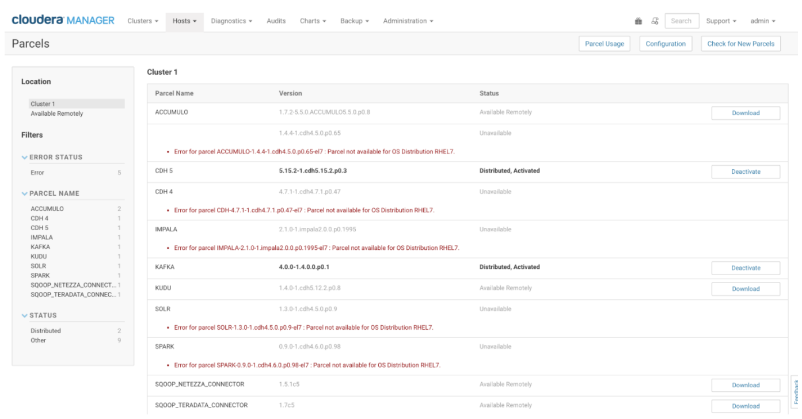

```
ps -aux | grep yum
kill [second column]
```

sudo visudo
```
## Next comes the main part: which users can run what software on
## which machines (the sudoers file can be shared between multiple
## systems).
## Syntax:
##
##      user    MACHINE=COMMANDS
##
## The COMMANDS section may have other options added to it.
##
## Allow root to run any commands anywhere
root    ALL=(ALL)       ALL
centos  ALL=(ALL)       ALL
```

# Install CM 5.15

## You have been provide with 5 nodes that have been prequalified to install CM 5.15

## and CDH 5.15. You will still need to complete the following:

1. Enable user / password login for each of the 5 nodes

a. Create a password for user “centos”
> ```
> sudo passwd
> ```

b. Modify sshd_config to allow password login
> ```
> sudo vi /etc/ssh/sshd_config
> ```

c. Restart the sshd.service
>```
>[centos@ip-172-31-10-234 ~]$ sudo systemctl restart sshd.service
>[centos@ip-172-31-10-234 ~]$ sudo systemctl status sshd.service
>● sshd.service - OpenSSH server daemon
>   Loaded: loaded (/usr/lib/systemd/system/sshd.service; enabled; vendor >preset: enabled)
>   Active: active (running) since Tue 2019-05-21 10:12:51 KST; 7s ago
>     Docs: man:sshd(8)
>           man:sshd_config(5)
> Main PID: 13653 (sshd)
>   CGroup: /system.slice/sshd.service
>           └─13653 /usr/sbin/sshd -D
>
>May 21 10:12:51 ip-172-31-10-234.ap-northeast-2.compute.internal systemd>[1]: Starting OpenSSH server daemon...
>May 21 10:12:51 ip-172-31-10-234.ap-northeast-2.compute.internal sshd>[13653]: Server listening on 0.0.0.0 port 22.
>May 21 10:12:51 ip-172-31-10-234.ap-northeast-2.compute.internal sshd>[13653]: Server listening on :: port 22.
>May 21 10:12:51 ip-172-31-10-234.ap-northeast-2.compute.internal systemd>[1]: Started OpenSSH server daemon.
>```

2. Setup /etc/hosts with the following information for each of the 5 hosts

a. Private_IP FQDN Shortcut

>```
>vi /etc/hosts
>getent hosts
>hostname -f
>sudo hostnamectl set-hostname [hostname]
>hostname -f
>```

##### public
```
15.164.146.95  master01.cdhcluster.com mn1  |13.124.135.81  
15.164.151.13  util01.cdhcluster.com util01 |15.164.27.64
15.164.86.198  data01.cdhcluster.com dn1    |52.78.236.138
15.164.5.68    data02.cdhcluster.com dn2    |54.180.186.127
15.164.63.69   data03.cdhcluster.com dn3    |54.180.38.41
``` 

##### privite
```
172.31.7.227  master01.cdhcluster.com mn1   |172.31.2.81
172.31.12.148 util01.cdhcluster.com util01  |172
172.31.8.146  data01.cdhcluster.com dn1     |
172.31.10.234 data02.cdhcluster.com dn2     |
172.31.3.22   data03.cdhcluster.com dn3     |
```

> ```
>      1 pc 
> ssh-keygen
>      and 
> ssh-copy-id -i ~/.ssh/id_rsa.pub [all node]
> ```

3. Change the hostname as necessary to the FQDN that you setup above

a. Reboot the host

4. Install JDK on each of the hosts (you may choose to install on just the host where you will install CM and use the Wizard later to install on the rest

```
sudo yum update
sudo yum install -y wget
yum list java*jdk-devel
sudo yum install -y java-1.8.0-openjdk-devel.x86_64
```

5. On the host that you will install CM:

a. Configure the repository for CM 5.15.2

```
sudo wget https://archive.cloudera.com/cm5/redhat/7/x86_64/cm/cloudera-manager.repo -P /etc/yum.repos.d/

vi /etc/yum.repos.d/cloudera-manager.repo
[cloudera-manager]
# Packages for Cloudera Manager, Version 5, on RedHat or CentOS 7 x86_64
name=Cloudera Manager
baseurl=https://archive.cloudera.com/cm5/redhat/7/x86_64/cm/5.15.2/
#baseurl=https://archive.cloudera.com/cm5/redhat/7/x86_64/cm/5/
gpgkey =https://archive.cloudera.com/cm5/redhat/7/x86_64/cm/RPM-GPG-KEY-cloudera
gpgcheck = 1

sudo rpm --import https://archive.cloudera.com/cm5/redhat/7/x86_64/cm/RPM-GPG-KEY-cloudera
```

b. Install CM

```
sudo yum update
sudo yum install 
sudo yum install -y cloudera-manager-daemons cloudera-manager-server
sudo systemctl start cloudera-scm-agent
```

c. Install and enable Maria DB (or a DB of your choice)

```
sudo yum install mariadb-server
sudo systemctl stop mariadb
```

> edit  /etc/my.cnf
> ```
> [mysqld]
> datadir=/var/lib/mysql
> socket=/var/lib/mysql/mysql.sock
> transaction-isolation = READ-COMMITTED
> # Disabling symbolic-links is recommended to prevent assorted security risks;
> # to do so, uncomment this line:
> symbolic-links = 0
> # Settings user and group are ignored when systemd is used.
> # If you need to run mysqld under a different user or group,
> # customize your systemd unit file for mariadb according to the
> # instructions in http://fedoraproject.org/wiki/Systemd
> 
> key_buffer = 16M
> key_buffer_size = 32M
> max_allowed_packet = 32M
> thread_stack = 256K
> thread_cache_size = 64
> query_cache_limit = 8M
> query_cache_size = 64M
> query_cache_type = 1
> 
> max_connections = 550
> #expire_logs_days = 10
> #max_binlog_size = 100M
> 
> #log_bin should be on a disk with enough free space.
> #Replace '/var/lib/mysql/mysql_binary_log' with an appropriate path for your
> #system and chown the specified folder to the mysql user.
> log_bin=/var/lib/mysql/mysql_binary_log
> 
> #In later versions of MariaDB, if you enable the binary log and do not set
> #a server_id, MariaDB will not start. The server_id must be unique within
> #the replicating group.
> server_id=1
> 
> binlog_format = mixed
> 
> read_buffer_size = 2M
> read_rnd_buffer_size = 16M
> sort_buffer_size = 8M
> join_buffer_size = 8M
> 
> # InnoDB settings
> innodb_file_per_table = 1
> innodb_flush_log_at_trx_commit  = 2
> innodb_log_buffer_size = 64M
> innodb_buffer_pool_size = 4G
> innodb_thread_concurrency = 8
> innodb_flush_method = O_DIRECT
> innodb_log_file_size = 512M
> 
> [mysqld_safe]
> log-error=/var/log/mariadb/mariadb.log
> pid-file=/var/run/mariadb/mariadb.pid
> 
> #
> # include all files from the config directory
> #
> !includedir /etc/my.cnf.d
> ```

```
sudo systemctl enable mariadb
sudo systemctl start mariadb
```

i. Don’t forget to secure your DB installation

```
sudo /usr/bin/mysql_secure_installation
.... y y n y y ....
```

d. Install the mysql connector or mariadb connector

```py
- mysql
wget https://dev.mysql.com/get/Downloads/Connector-J/mysql-connector-java-5.1.46.tar.gz
tar zxvf mysql-connector-java-5.1.46.tar.gz
sudo mkdir -p /usr/share/java/
cd mysql-connector-java-5.1.46
sudo cp mysql-connector-java-5.1.46-bin.jar /usr/share/java/mysql-connector-java.jar
```

e. Create the necessary users and dbs in your database

```
mysql -u root -p
```

```
CREATE DATABASE scm DEFAULT CHARACTER SET utf8 DEFAULT COLLATE utf8_general_ci;
CREATE DATABASE amon DEFAULT CHARACTER SET utf8 DEFAULT COLLATE utf8_general_ci;
CREATE DATABASE rmon DEFAULT CHARACTER SET utf8 DEFAULT COLLATE utf8_general_ci;
CREATE DATABASE hue DEFAULT CHARACTER SET utf8 DEFAULT COLLATE utf8_general_ci;
CREATE DATABASE metastore DEFAULT CHARACTER SET utf8 DEFAULT COLLATE utf8_general_ci;
CREATE DATABASE sentry DEFAULT CHARACTER SET utf8 DEFAULT COLLATE utf8_general_ci;
CREATE DATABASE oozie DEFAULT CHARACTER SET utf8 DEFAULT COLLATE utf8_general_ci;
```

i. Grant them the necessary rights

```
GRANT ALL ON scm.* TO 'scm-user'@'%' IDENTIFIED BY 'somepassword';
GRANT ALL ON amon.* TO 'amon-user'@'%' IDENTIFIED BY 'somepassword';
GRANT ALL ON rmon.* TO 'rmon-user'@'%' IDENTIFIED BY 'somepassword';
GRANT ALL ON hue.* TO 'hue-user'@'%' IDENTIFIED BY 'somepassword';
GRANT ALL ON metastore.* TO 'metastore-user'@'%' IDENTIFIED BY 'somepassword';
GRANT ALL ON sentry.* TO 'sentry-user'@'%' IDENTIFIED BY 'somepassword';
GRANT ALL ON oozie.* TO 'oozie-user'@'%' IDENTIFIED BY 'somepassword';
```

```
FLUSH PRIVILEGES;
SHOW DATABASES;
EXIT;
```

f. Setup the CM database

```
sudo /usr/share/cmf/schema/scm_prepare_database.sh mysql scm scm-user somepassword
sudo rm /etc/cloudera-scm-server/db.mgmt.properties
```

g. Start the CM server and prepare to install the cluster through the CM GUI installation process

```
sudo systemctl start cloudera-scm-server
```

# Install CDH 5.15.2 Cluster

## Go to the CM GUI installer and install CDH 5.15.2

1. Specify hosts for your CDH cluster installation

```
enterprize 버전으로 선택.
모든 숏컷 주소를 적어 셋팅  mn1, util01, dn1, dn2, dn3
디폴트로 진행진행진행
```

2. You may choose to use a common user / password

```
사용할 계정 정보 및 비밀번호 입력
즉 모든 곳에 동일한 계정이 셋팅되어야됨.
```

3. Allow CM to install CM Agent on each of the nodes

4. Allow CM to download, distribute and activate CDH on each of the nodes

5. Choose the type of installation you want

a. We will require Flume, Hive, Impala later on

6. Assign roles to each of the hosts: Please refer here for hints. 

|Master Hosts	|Utility Hosts/	Gateway Hosts|	Worker Hosts|
|---|---|---|
|Master Host 1:      |One host for all Utility and Gateway roles: |Gateway configuration|
|NameNode            |Secondary NameNode                          |3 - 10 Worker Hosts: |
|YARN ResourceManager|Cloudera Manager                            |DataNode             |
|JobHistory Server   |Cloudera Manager Management Service         |NodeManager          |
|ZooKeeper           |Hive Metastore                              |Impalad              |
|Kudu master         |HiveServer2                                 |Kudu tablet server   |
|Spark History Server|Impala Catalog Server                       |                     |
|                    |Impala StateStore                           |                     |
|                    |Hue                                         |                     |
|                    |Oozie                                       |                     |
|                    |Flume                                       |                     |

> ZooKeeper 3곳에.

# Install Sqoop, Spark and Kafka

## Installing Kafka requires some special attention. You will need to download, distribute and activate the Kafka package before you can add the Kafka service.



+ Create user “training” with password “training” and add to group wheel for sudo access.

all node에 계정 생성
```
adduser training
passwd training
usermod -aG wheel training
```

+ Log into Hue as user “training” with password “training”

 - This will create a HDFS directory for the user

+ Now, try ssh’ing into the hosts as user “training”

+ From the bit.ly folder, download all.zip and unzip it.

util01, dn1
```
scp -i [pem key file] [source file] [desti login id]@[destination ip/host : ~/desti folder]
```

 - Do this in both your CM host and one of the datanode hosts.

 - Go to training_material/devsh/scripts and review the setup.sh
 
util01, dn1
```
sudo yum install -y unzip
unzip all.zip
```

   * See how it works. We are going to use it to create some data for ourselves but it won’t work right away. See if you can figure out what needs to be done to make it work.

   * You will need to add user “training” with password “training” to your MySql installation and Grant the necessary rights

```
mysql -u root -p
GRANT ALL ON *.* TO 'training'@'%' IDENTIFIED BY 'training';
```

+ Now, attempt some of the exercises that we did during our previous lessons in our new Hadoop cluster.

 - You should practice the following as a minimum

   * Flume

   * Sqoop

   * Hive

   * Impala

   * Spark

# Sqoop And Hive

### Sqoop with Meta

#####  sudo -u hdfs hdfs dfs -chown training /loudacre

```
sqoop import --connect jdbc:mysql://util01/loudacre \
             --table device \
             --username training --password training \
             --hive-import \
             --hive-table device_ex2
```

### Sqoop Parquet and Hive make tables

```
sqoop import \
--connect jdbc:mysql://util01/loudacre \
--username training --password training \
--table basestations \
--target-dir /loudacre/basestations_import_parquet \
--fields-terminated-by ("|")
--as-parquetfile
```

Hive 0.10 - 0.12
```
CREATE TABLE parquet_test (
 id int,
 str string,
 mp MAP<STRING,STRING>,
 lst ARRAY<STRING>,
 strct STRUCT<A:STRING,B:STRING>) 
PARTITIONED BY (part string)
ROW FORMAT SERDE 'parquet.hive.serde.ParquetHiveSerDe'
 STORED AS
 INPUTFORMAT 'parquet.hive.DeprecatedParquetInputFormat'
 OUTPUTFORMAT 'parquet.hive.DeprecatedParquetOutputFormat';
```

Hive 0.13 and later
```
CREATE TABLE parquet_test (
 id int,
 str string,
 mp MAP<STRING,STRING>,
 lst ARRAY<STRING>,
 strct STRUCT<A:STRING,B:STRING>) 
PARTITIONED BY (part string)
STORED AS PARQUET;
```